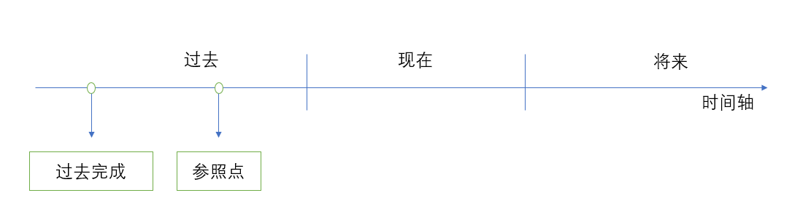
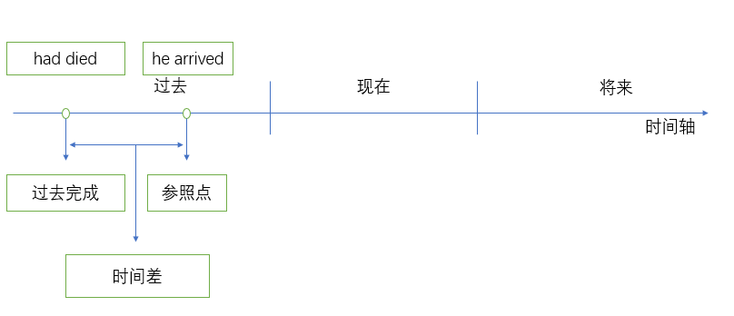

## 过去完成时

### detail

Ex1: She **had died** by the time he **arrived** at the hospital.

## 过去完成进行时

There are two focuses on past perfect continuous tense:

1. complement
2. ongoing

Which focus is the primary, it depends on the context.

Ex1: She had been working here for ten years before the new boss came.

- focus1: worked for ten years.
- focus2: had been working before the new boss came.

Apparently, 'worked for ten years' is the primary focus.

So 'She had worked here for ten years before the new boss came' also works.

### more examples

1. A: Why did he look so tired.
   B: Because he had been working overnight.

   - focus1: worked overnight. (The question is exerted the next day)
   - focus2: had been working. (had been working without taking rest.)

   So 'he had worked overnight' is not properly here.

2. I had been working on the novel when she entered the room to talk to me.
   (她进来跟我说话之前，我一直在写小说。言外之意，她跟我说话打断了我的计划)

   - focus1: was working on the novel.
   - focus2: was interrupted temporarily.
     Here, the primary focus is 'was interrupted by her'.
     Look at the similar example: I was working on the novel when she entered the room to talk to me. (她进来跟我说话的时候，我还在写小说。言外之意，我没有被打断。)

## practices

### 过去完成进行时

1. A: 昨天我们遇到 Tom 时，为啥他的眼睛那么红呐？ B: 因为他之前一直在哭。 
   Why was Tom's eyes so red when we met him yesterday? Because he had been crying.

2. 开始下雨之前，他已经跑了 2 小时了。 
   He had been running for two hours before it began to rain.

3. He had been writing for 10 years before his first novel was published. 
   从事写作 10 年了，他的第一本小说才得以出版。
