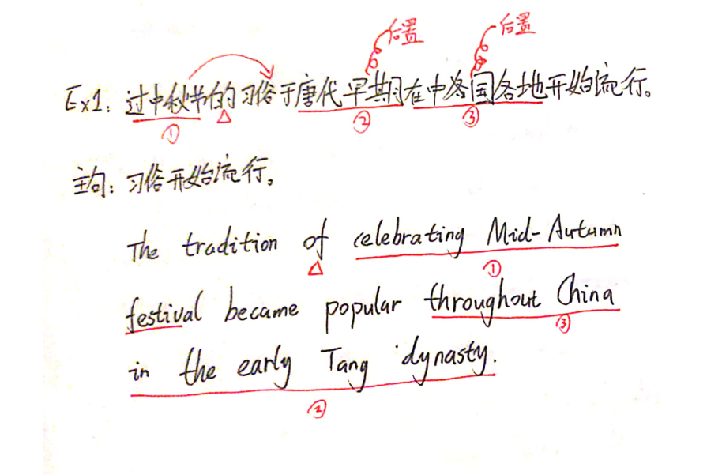
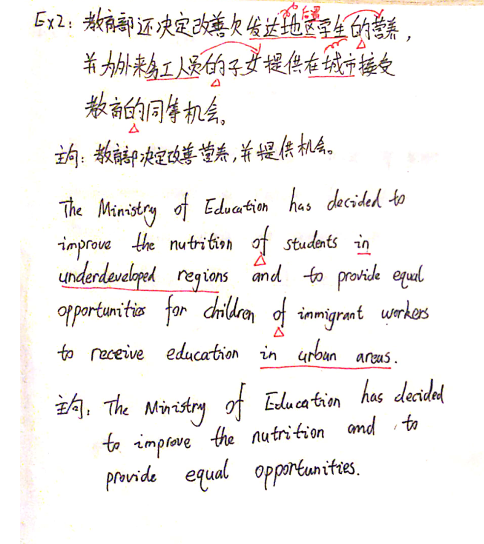
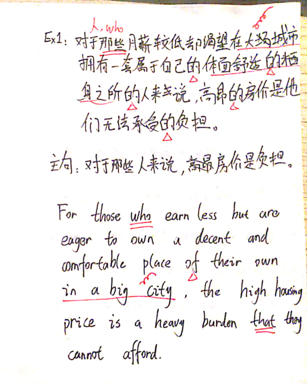
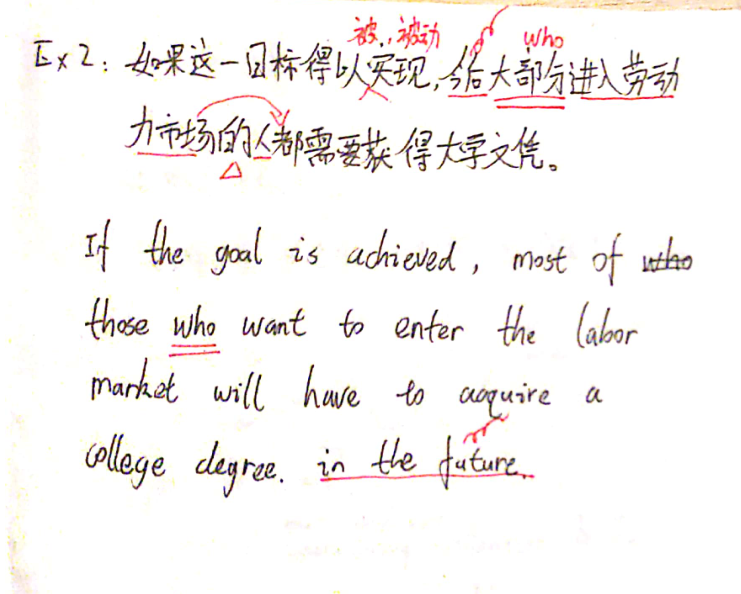
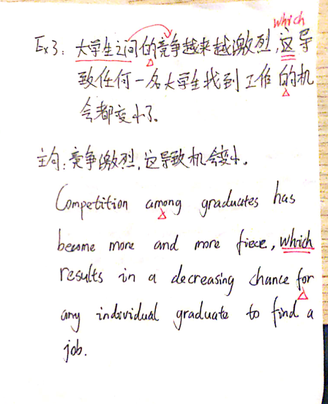
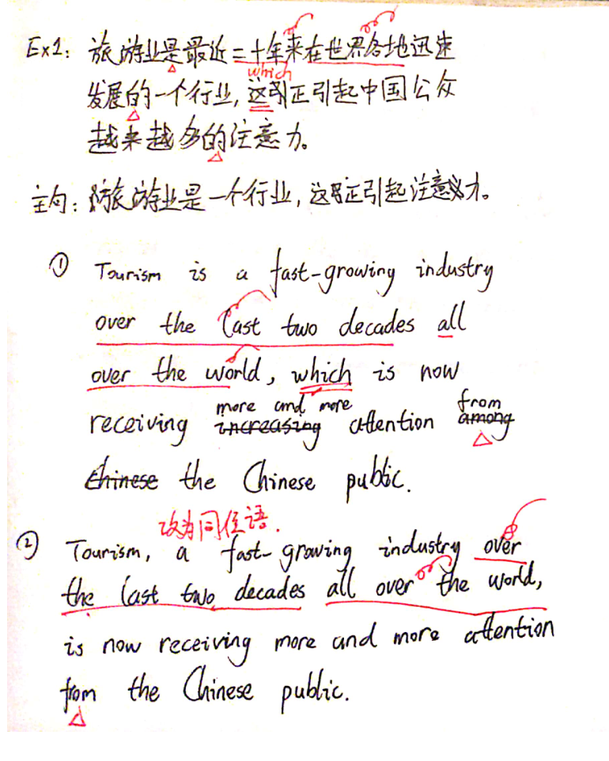
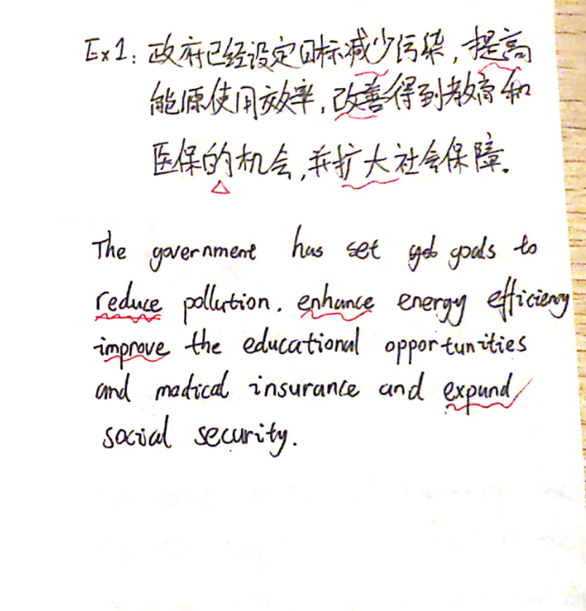
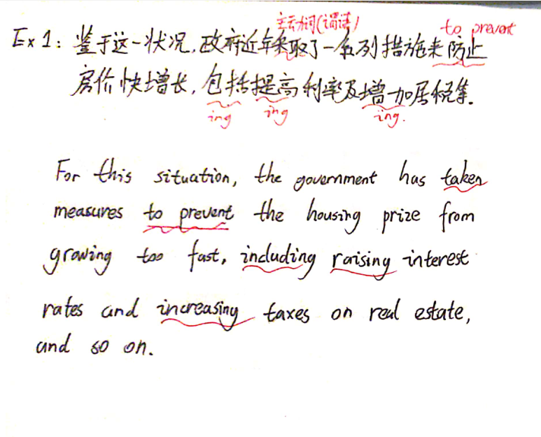
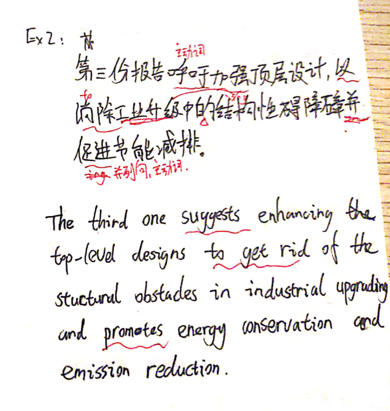
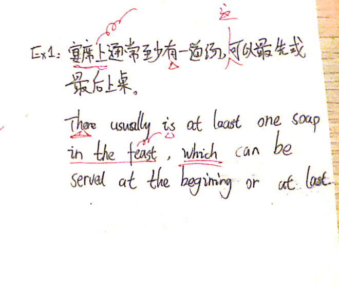

## 听力

<!-- ### 视听一致原则

视听一致：信息越一致，越可能是正确的答案。（**比较使用于简单题**）

1. 关键信息于音频完全一致。
2. 关键信息在音频中出现的次数越多。如果出现的次数一样多时，
   则需要选择符合问题的选项。 -->

### 关键词原则

### 同转原则

### 正确及错误答案的特点

## 翻译

翻译的关键：

1. 不错。句子没有明显的语法和词汇错误。
2. 语序正确。注意中文和英文之间的语序差异。

### 修饰后置

使用条件：

1. 定语较长。
2. 元素复杂。

常见的句式：

1. 状语。

   - 时间
   - 地点

2. 定语。
   - xxx 的

#### 介词的使用

原则：

1. 使用了介词 > 错误使用介词 > 无使用介词。
2. 是否使用介词还取决于能否用形容词直接表示。如果可以用
   形容词直接表示，那么就不需要介词。

例如： 他们渴望拥有一套属于自己的体面舒适的栖身之所。

1. They are eager to own a decent and comfortable place
   of their own.
2. They are eager to own their decent and comfortable place.

这里 **体面舒适的** 就可以直接使用形容词进行修饰。

**属于自己的** 也可以直接修饰，如第 2 句所示，但是这样会导致
头重脚轻，所以最好的方式是将修饰词进行后置，如第 1 句所示。

常用的介词有：of, in, for, ...

Ex1: 过中秋节的习俗于唐代早期在中国各地开始流行。
The tradition of celebrating Mid-Autumn festival became popular throughout China in the early Tang dynasty.

Ex2: 教育部还决定改善欠发达地区学生的营养，
并为外来务工人员的子女提供在城市接受教育的同等机会。

The Ministry of Education has decided to improve the
nutrition of students in underdeveloped regions and to
provide equal opportunities for children of immigrant
workers to receive education in urban areas.

#### 定语从句

定语从句的分类：

- 限制性定语从句：that, who, when, where, ...
- 非限制性定语从句：which. （中文句式：这，该，其，此）

Ex1: 对于那些月薪较低却渴望在大城市拥有一套属于自己的
体面舒适的栖身之所的人来说，高昂的房价是他们无法承受的负担。

For those who earn less but are eager to own a decent and
comfortable place of their own in a big city, the high
housing price is a heavy burden that they cannot afford.

Ex2: 如果这一目标得以实现，今后大部分进入劳动力市场的人
都需要获得大学文凭。

If the goal is achieved, most of those who want to enter
the labor market will have to acquire a college degree in
the future.

Ex3: 大学生之间的竞争越来越激烈，这导致任何一名大学生找到工作
的机会都变小了。

Competition among graduates has become more and more fierce,
which results in a decreasing chance for any individual
graduate to find a job.

#### 插入语

使用条件：

1. 该句为翻译开头句。
2. 名词解释。

Ex1: 旅游业是最近二十年来在世界各地迅速发展的一个行业，这引起
中国公总越来越多的注意。

1. Tourism is a fast-growing industry over the last decades
   all over the world, which is now receiving more and more
   attention from the Chinese public.

2. Tourism, a fast-growing industry over the last two
   decades all over the world, is now receiving more
   and more attention from the Chinese public.

### 多动词

#### 动词与动词地位相同

使用并列结构：

$v_1$, $v_2$ and $v_3$

Ex1: 政府已经设定目标减少污染，提高能源使用效率，改善得到教育
和医保的机会，并扩大社会保障。

The government has set goals to reduce pollution, enhance
energy efficiency, improve the educational opportunities
and medical insurance and expand social security.

#### 动词之间地位不同

1. 找到主动词（也就是句子中的谓语）
2. 其他动词使用其对应的格式。
   - to do: 表示目的。如：来，以达到，为了。
   - doing: 主动。
   - done: 被动。

Ex1: 鉴于这一状况，政府今年来采取了一系列措施来防止房价快增长，
包括提高利率及增加居税等。

For this situation, the government has taken a series of
measures to prevent the housing price from growing too
fast, including raising interest rates and increasing
taxes on real estate, and so on.

Ex2: 第三份报告呼吁加强顶层设计，以消除工业升级中的结构障碍并
促进节能减排。

The third one suggests enhancing top-level designs to
get rid of the structural obstacles in industrial
upgrading and promotes energy conservation and emission
reduction.

Ex3: 市政府还计划建造一批水循环利用工厂，并制止违章建筑，用以
改善环境。

The municipal government also plants to construct some
plants to use cycle water, banning illegal constructions
to modify environment.

### 无主语

#### 补充主语（不推荐）

#### 转被动

Ex1: 必须保持每天 8 个小时睡眠。

（缺失主语，直接使用被动）

Eight hours' sleep must be guaranteed every day.

Ex2: 因此，强烈建议大学生在课余时间做一些兼职工作，以积累相关
的工作经验。

（由于这里没有提及谁建议的，采用被动语态较为合适）

Therefore, college students are strongly suggested to do
some part-time jobs in their spare time to accumulate
relevant working experience.

#### 非人主语 - 有/存在

there be / exist

Ex1: 宴席上通常至少有一道汤，可以最先或最后上桌。

There usually is at least one soap in the feast, which can
be served at the beginning or at last.

### 示例

#### Online courses

网课是一种新兴的学习方式，是为学习者提供以互联网为平台，内容
包含视频、图片、文字互动等多种形式的系列学习教程。区别于线下课堂
教授，网课具有灵活便捷等优点。越来越多的学生群体和父母开始使用。
一场突如其来的疫情爆发，打乱了我们的生活节奏，但是在当今在线
教育的帮助下，学习者可以通过在家上网学习，只要有网的地方，即可
利用碎片化的时间学习。农村家挺的学生也可以通过互联网接受正规
免费的课程教育，让他们“听课不停学，学习不延期”。

Online courses, an emerging way of learning, is a series courses based on the Internet, which provide learners content including videos, picture and text interaction, and so on. Different from offline classes, online courses have a lot of advantages, such as flexibility and convenience. An increasing students' groups and parents began to use it. As a sudden outbreak of epidemic, our pace of life has been disrupted. Today, however, people can study at home by using the Internet with the help of online education. As long as there is access to the Internet, individuals are able to study by using their fragmented time. Those students who come from rural families can also receive formal and free online education, allowing them to suspend classes without postponing their studies.

**好词好句:**

1. An emerging way of learning: 一种新兴的学习方式。
2. Our pace of life: 生活的节奏。
3. As long as: 只要，就
4. suspend classes without postponing their studies: 停课不停学。

#### Traditional Chinese Medicine

中医，**也称**汉医，主要指的是以中国**汉族**创造的传统医学，是研究人体以及疾病的诊断和防治等的一门**学科**。早在两千年前，**中医专著**《黄帝内经》**问世**，**奠定了**中医学的基础。中医具有完整的理论体系，它认为人体各个器官是**处于同一个整体**并且**相互联系**。其诊法，包括传统的望闻问切都不同于现代医疗。**经过几千年**的**临床实践**，**证实**了中国的中医中药**无论是**在治疗疾病上、在防病上还是在养生上，都是确凿有效可行的。

Traditional Chinese Medicine, as known as Han Medicine, mainly refers to the traditional medicine created by the Chinese Han nationality, which is a discipline studying the human body and diagnosis and prevention of disease.

As early as 2000 years ago, _Huang Di Nei Jing_, a traditional Chinese masterpiece, was published. And this book has laid the fundament of Traditional Chinese Medicine.

Traditional Chinese Medicine has a complete theoretical system, which holds that various organs of the human body are on the same whole and interrelated.

Its diagnosis, including the traditional observation, hearing, inquiry and measuring, is different from the modern medicine.

Over thousands of years of clinical practice, it has been proved that Traditional Chinese Medicine is effective and feasible no matter in curing, preventing diseases and maintaining health.

**好词好句**：

1. As known as: 也称。
2. Refer to: 指的是。
3. the Chinese Han nationality: 汉族。
4. discipline：学科。
5. As early as 2000 years: 早在两千年前。
6. A masterpiece of Traditional Chinese Medicine: 中医专著。
7. be published: 问世。
8. lay fundament of: 奠定了 x 的基础。
9. on the same whole: 处于一个统一的整体。
10. interrelated: 相互关联的。
11. clinical practice: 临床实践。
12. no matter in: 无论是在 xxx.

#### Garbage classification

随着城市化的发展，垃圾问题越来越成为困扰中国很多城市和乡村的问题。
垃圾分类就是将垃圾分门别类地投放，并通过清运和回收，使其重新变成资源。
它可以减少垃圾处理量，降低处理成本，减少土地资源的消耗，对社会、经济和生态三方面都有益。
时下，“垃圾分类”的理念已经获得广大居民的认可。垃圾分类是社会进步和生态文明的标志，是人人均可参与的保护环境和改善环境的方式。

Due to the development of urbanization, garbage classification is becoming an increasingly difficult problem that plagues all cities and villages in China.

Garbage classification is to put garbage into different categories and transform it into resources again by cleaning away and recycling.

Garbage classification can reduce the quantity of garbage disposal, lower the cost of processing and diminish the consumption of land resources, which is beneficial to society, economy and ecology.

Nowadays, the concept of Garbage Classification has been recognized by majorities of residents.

Garbage classification is a symbol of social progress and ecological civilization. It is a way for everyone to participate in protesting and improving the environment.

#### new energy vehicle

新能源汽车是指采用非常规的车用燃料作为动力来源的汽车。
近年来，政府高度关注新能源汽车的研发和产业化，形成了完整的新能源汽车研发和示范布局。
我国的新能源汽车的产销了逐年增加。
发展新能源汽车可作为解决能源及环境问题、实现可持续发展的重要手段。
目前，国家在新能源汽车发面给与了很大的政策和资金支持。
国家决定免征系能源汽车的购置税，这将进一步减轻消费者的购买负担，刺激私人购买新能源汽车。

New energy vehicles are vehicles that use non-conventional motor fuel as a source of power.

In recent years, the government has paid great attention to the research and development and industrialization of new energy vehicles. Therefore, a complete layout of research and development and demonstration of new energy vehicles has been formed.

The production and sales of new energy vehicles in our country have increased year by year.

The development of new energy vehicles can be used as an important means to solve energy and environmental problems and achieve sustainable development.

At present, the state has offered favorable policies and great financial support in the field of new energy.

The state has decided to exempt the purchase tax for new energy vehicles, which will further reduce the purchase burden on customers and stimulate the private purchase of new energy vehicles.

**好词好句：**

1. 采用 xxx 作为动力来源。

   use xxx as a source of power.

2. 高度关注。

   pay great attention to xxx.

3. 研发和产业化。

   the research and development and industrialization.

4. 产销量。

   the production and sales of xxx.

5. 作为 ... 的手段。

   can be used as a means to xxx.

6. 实现可持续发展。

   achieve sustainable development.

7. 给予/提供 政策和资金支持。

   offer favorable policies and great financial support.

8. 免除 xxx 税收。

   exempt the xxx tax on yyy.

9. 减轻负担。

   reduce the xxx burden on xxx.

#### Tai Chi

作为我国以向非物质文化遗产，太极拳（Tai Chi）是一种极富中国传统民族特色的文化形态。它由一系列柔和、缓慢的动作组成，具有颐养性情、强身健体、技击对抗等功能。由于太极拳是在近代形成的拳种，流派众多，群众基础广泛，因此成为中国武术（martial arts）中非常具有生命力的一支。太极拳看起来像是一种舞蹈，但它不需要你跟随音乐而起舞，而是需要你倾听来自内心的节奏。练习太极拳对人类个体身心健康有极为重要的促进作用。

Tai Chi, as an intangible cultural heritage in our country, is a cultural form that full of traditional Chinese characteristics. It consists of a series of soft and slow movements with functions of maintaining nature, improving physical fitness and combating, and so on.
Because Tai Chi is a kind of boxing that has been formed in modern times, it has many different genres and a wide range of participants. It has become a very vital part of Chinese martial arts. Tai Chi seems a dance that requires you to listen to the inner rhythms from your heart instead of dancing to the music. Practicing Tai Chi is extremely important for the physical and mental health of human beings.

**好词好句：**

1. 非物质文化遗产。

   intangible cultural heritage.

2. 由 xxx 组成。

   yyy consists of xxx.

3. 颐养性情。

   maintain nature

4. 强身健体。

   improve physical fitness.

5. 流派众多。

   has many different genres.

6. 群众基础广泛。

   has a wide range of participants.

7. 身心健康。

   the mental and physical health of human beings.

## 作文

### 分类

1. 议论文
   - 现象解释型：what, why, importance.
   - 问题解决型：how to.
   - 观点选择型：whether, choice, option, measures.
2. 谚语类
3. 图表

### 三段论

通用模板：（对于不同类型的议论文，需要修改第一段和最后一段即可）

Due to the proliferation of \_economy/society/globalization/education\_, \_主题词\_ has become increasingly important. It's of great necessity for \_students/staff/employees/individuals\_ to \_主旨句\_. The reasons mainly lie in the following three respects.

First off, there is no doubt that \_xxx\_ serves as a remarkable contributor to promoting \_核心论点\_. Research demonstrates that a majority of \_social elites\_ admitted that \_论据\_. Furthermore, never can we ignore the \_indispensability/value\_ of \_family harmony/knowledge/culture\_. Where there is/are \_xxx\_, there is/are \_xxx\_. Last but not least, \_论点 3\_. Only when \_论据 3\_, can they keep pace with the development of the competitive \_society/job market\_.

To summarize, taking into account all the factors above, I reiterate my standpoint that \_xxx\_ is a need.

**对于观点选择型，需要修改第一段**

Due to the proliferation of \_xxx\_, \_xxx\_ has triggered a heated discussion. Some argue passionately that \_xxx\_. Other, in contrast, are in line with view that \_xxx\_, which is also my standpoint. The reasons mainly lie in the following three respects.

**对于谚语类，需要修改第一段和最后一段**

开头段：
The profound meaning lying in the saying, xxx, persuades to \_\_. And why \_xxx\_ is/are extremely important? The reasons mainly lie in the following three respects.

结尾段：
To summarize, taking into account all the factors above, it is advisable to \_\_.

### 常用句子

1. the more xxx, the more xxx.

   The more people use it, the more useful it is.

2. Research demonstrates that xxx do more when xxx than xxx do when xxx.

   Research demonstrates that children learning when they are taught in their mother tongue than they do when they are taught in any other language.

3. Some are horrified at the prospect of people doing .... Others, who(whose) ..., argue passionately for ...

   Some are horrified at the prospect of people playing God. Others, whose live are blighted by childlessness or genetic disease, argue passionately for the right to alleviate suffering.

4. it did in the case of ...

   As it did in the case of Alfred Bloggs who worked as a dustman for the Ellesmere Corporation.

5. That has happened in xxx.

6. It is xxx, rather than xxx, that win xxx ...

   It was a good education in his mother tongue, rather than in the classic then favored by the British aristocracy, that won Churchill the Novel Prize in Literature.

7. xxx gain a better grasp of the mechanics of doing xxx

   Students will gain a better grasp of the mechanics of reading and writing when they are learning the skill in a language they understand.

8. Only when xxx ...., can they xxx and become such persons who xxx.

   Only when college students have the ability to meet challenges, can they keep pace with the development of this competitive society and even become such persons who lead the world ahead.

## 高级词汇与替换

### 句式

#### common

1. Due to the proliferation of xxx,

   - with the development of,

2. xxx has more and more xxx.

   - xxx has risen steeply.
   - xxx has increasingly xxx

3. there is no double/denying that
   - no one can deny
   - no one disputes
4. As is known to all
5. It is evident that
6. xxx plays an extremely important role in xxx.
   - xxx serves as a remarkable contributor to doing xxx.
7. on the same whole.
   - ex1: Traditional Chinese Medicine holds that various organs of the human body are on the same whole.
8. be used as a means to xxx.
   - ex1: Developing new energy vehicles can be used as an significant means to solve energy and environmental problems and achieve sustainable development.
9. exert a positive/widespread/lasting impact on xxx.
    - ex1: It has exerted a widespread and lasting impact on Chinese culture.
10. expose a negative impact on xxx.
11. make contributions to
    - ex1: So that they can make contributions to our society.
12. Only when xxx, can xxx.
    - ex1: Only when students own the ability to meet challenges, can they keep pace with the development of our society and become such persons who develop in an all-around way.
13. have a ability to do
    - be competent to do.
    - ex1: Students should have a ability to meet challenges. Students should be competent to meet challenges.

#### education

1.  An emerging way of xxx.
    - ex1: Online courses is an emerging way of learning.
2.  suspend their classes without postponing their study.
    - ex1: Online education allows them to suspend their classes without postponing their studies.
3.  lay fundament of xxx.
    - ex1: This book has laid fundament of Traditional Chinese Medicine.
4. gain a better grasp of the mechanics of doing.
   - Ex1: Perhaps this because they gain a better grasp of the mechanics of writing and reading when then are learning the skills in a language they understand.

#### environmental protection

1. energy conservation and emission reduction
   Developing new energy vehicle favor achieving energy conservation and emission reduction.

#### illustration, saying, proverb

1. The profound meaning lying in the proverb persuades us to

### 名词

#### 影响

1. impact
   - It has exerted a widespread and lasting impact on Chinese culture.
   - Its impact has gone far beyond the border and a growing number of readers find the stories in the book vivid, moving and interesting.
2. effect
3. influence
   - with the rapid economic growth and increasing global influence of China, more and more foreigners have started to learn Chinese.
   - It has continually attracted and deeply influenced generations of readers.

产生好的影响：

1. exert a widespread and last impact/influence.
2. have a salutary effect.

产生坏的影响；

1. expose a negative impact on xxx.

#### 优点

1. advantage
   - I gained an immense advantage over the cleverer boys. They all went on to learn Latin and Greek and splendid things like that.
   - Advantages abound,
2. benefit
   - All of which has, of course, been of great benefit to this newspaper, which has been floated on a rising linguistic tide.
3. strength
   - Tolerance is prized as a strength, not despised as a weakness.
4. merit
5. virtue

#### 缺点

1. disadvantage
2. shortcoming
3. drawback
4. flaw

#### 方法

1. approach to
2. method of doing sth.
3. means of doing sth.

### 动词

#### 认为

1. reckon
2. claim
3. argue
4. state
5. assert

#### 表明 (show)

1. reveal
2. demonstrate
3. indicate

#### 提高

1. improve
2. boost
3. promote
4. enhance

#### 讨厌

1. hate
2. dislike
3. loathe
   - If you loathe something, you dislike it very much.
4. abhor
   - If you abhor something, you hate it very much.

### 形容词

#### 好的 (good)

1. remarkable
2. tremendous
3. excellent
4. superior
5. outstanding

#### 坏的 (bad)

1. negative
2. adverse
3. undesirable
4. dreadful

#### 重要的

1. important
2. significant
3. crucial
4. critical

#### 大的 (large)

1. gigantic
2. enormous
3. tremendous
4. vast
5. considerable

### 副词

#### 但是

1. however
2. nevertheless
3. nonetheless

#### 因此

1. therefore
2. hence
3. thus

#### 非常

1. extremely
2. exceedingly
3. outstandingly
4. exceptionally
