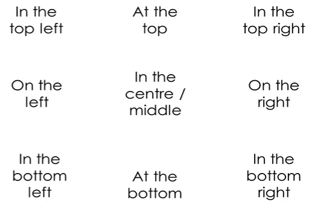

## Summarize what you see

## Describe where things are

## Adding details to your description

## Speculating about the pictures

## Speculating about the context of the pictures

## Making a long answer

## Reference

- [How to Describe a Picture in English - Spoken English Lesson](https://www.youtube.com/watch?v=ihIQ8_-49Fo)
