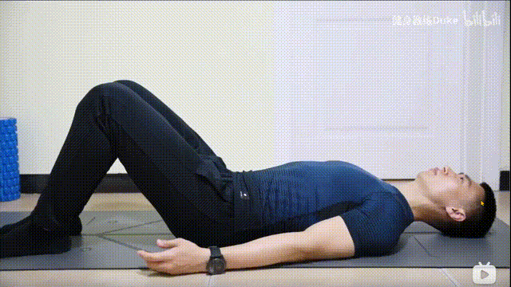
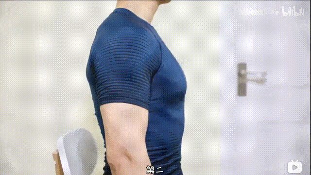
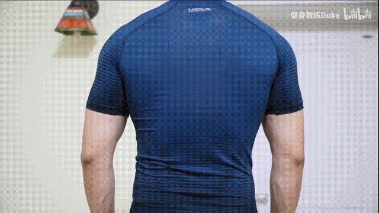

## 胸式呼吸

特点：吸气的时候，胸腔打开，肚子收缩；呼气的时候，胸前收缩，肚子膨胀。

## 腹式呼吸

特点：吸气的时候，肚子膨胀；呼气的时候，肚子收缩。

## 圆桶式呼吸

特点：吸气的时候，肚子和腰一圈向外顶；呼气的时候，保持腹内压不变。（用力的时候憋气就会出现这种效果）

## 不同种类呼吸的应用场景

1. 腹式呼吸。

   - 放松时，采用腹式呼吸，既有深度又放松。
   - 能更好地适应更高强度的训练。如：力量训练、有氧运动、唱歌。

   

2. 胸式呼吸。

   - 剧烈运动时可以采用胸式呼吸，虽然呼吸浅，但快。

   

3. 圆桶式呼吸。
   - 核心正位需要发力的时候，采用圆桶式呼吸，既稳重又有力。
     
