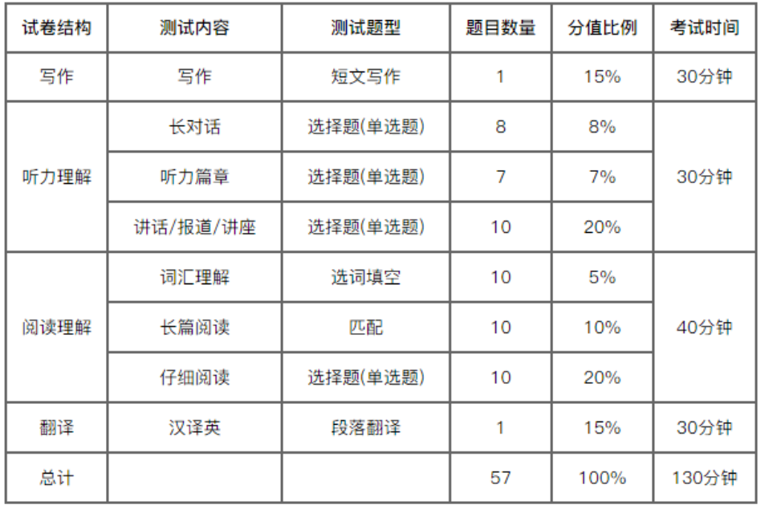

## 未完成

### 职业发展

|         计划         |                                          description                                           |      开始时间      |     结束时间      | status |
| :------------------: | :--------------------------------------------------------------------------------------------: | :----------------: | :---------------: | :----- |
|   第一份互联网实习   |                                       进入互联网公司实习                                       | 2021 年 6 月 20 日 | 2021 年 9 月 1 日 | 未完成 |
|       英语六级       |                                      CET6 达到 450 分以上                                      | 2021 年 5 月 28 日 |    大学毕业前     | 未完成 |
| 进入心仪的互联网公司 | 进入心仪的互联网公司，并且作为榜样，证明学习是有用的，其次就是学习的自驱力的兴趣而非为了学分。 | 2021 年 5 月 28 日 |     大学毕业      | 未完成 |

### 兴趣爱好

|  计划  |        description         | 开始时间 | 结束时间 | status |
| :----: | :------------------------: | :------: | :------: | :----- |
| guitar | 学习吉他，培养对音乐的乐趣 | 大三暑假 | 大学毕业 | 未完成 |

## 实现步骤

### 职业发展

#### 第一份互联网实习

1. 选择一条正确的赛道。目前最好的选择是将前端的知识吃透，而不是包罗万象。
   可以从一下方面努力。
   - 独自开发一个项目。目前最好的选择是将之前开发的 Music App 进行完善。
   - 复习以往学过的知识。
   - 深入理解设计模式。可以研读《Head First 设计模式》，同时，观看[【全网首发:更新中】颠覆认知的『设计模式实战』【TypeScript + JavaScript】](https://www.bilibili.com/video/BV1Py4y1D7TA)加深对设计模式的理解。
   - 学习前端测试。可以通过【Typescript 重构 axios】学习如何如何对库函数的基本测试。
   - 学习 `Vue` 的源码。通过
     [vue 源码分析](https://www.bilibili.com/video/BV1LE411e7HE?t=676&p=17)
     对 `Vue` 源码有基本的认识后，自己打断点，研读 `Vue` 的源码。关注点：如何提高
     性能，以及一些开发中的小技巧。
   - 其他方面。
     - 使用 `Vue3` 开发一个小程序。
     - 实现一个 `mini-vuex`。
     - 实现一个 `mini-vrouter`。
2. 简历的制作。简历的制作可能是自己的一个痛点，对此可以从一下方面努力：
   - 参照前辈的建议。可以从网上看一些前辈给的互联网面试指南，参照其给的面试
     指南对简历进行完善。
   - 寻求朋友的帮助。寻求从事 HR 工作的朋友的帮助。
3. 个人形象。
   - 干净。保持外表干净，不邋遢。
   - 打扮。工作装/polo 衫/有领带的上衣，皮鞋，黑色长裤。
4. 语言表达。日常交流的时候注意自己的言行。主要需要做到一下几点：
   - 表达清晰。沟通最基本的要求就是让对方知道我们想要
     表达的内容，所以，首先要从这个方面努力。
   - 不阴阳怪气。不阴阳怪气主要需要做到不乱用“您”这些奇怪的表达。
     不要乱吹，除了某些情况需要委婉的表达之外，有话就直说。

#### 英语六级

1. 听力。要求：120 分。
   - 先从 15-25 题努力。摸清题型以及出题的方式。
2. 写作。要求：85 分。
   - 通用模板。
   - 摸清题型。
   - 小众模板。
   - 阅读 2017-2019 英语范文，从中找出规律，并配置模板。
3. 翻译。要求：80 分。
   - 常见的词组。
4. 阅读。要求：160 分。

#### 进入心仪的互联网公司

### 兴趣爱好

#### guitar

## 已完成
